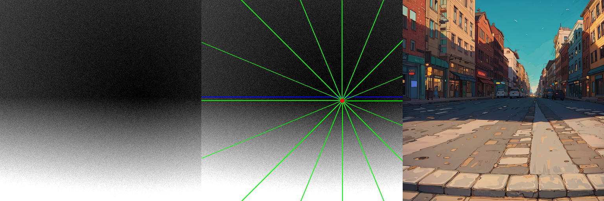
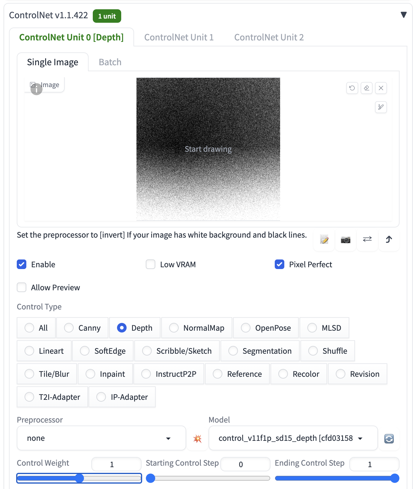

# **Floor Depth Map Generator**

このPythonスクリプトは、カメラの視点から見た床の深度マップを生成します。

任意の消失点を使用して深度マップを作成し、その結果を画像として保存します。

StableDiffusionのControlNetと組み合わせると、ファジーな1点透視パースで画像生成したりできます。

消失点のコントロールは他にも色々とやり方はあると思いますが、何よりオリジナルのControlNetを使える手軽さと、汎用性の高さが強みです。

放射状のノイズと、一様なノイズを組み合わせて、消失点のある深度マップをシミュレートしており、ControlNetのDepth入力にそのまま与えるだけで、狙ったパースを実現できます。

即席なので、計算式若干間違っているかも。その際はご勘弁ください。



## Automatic1111への入力

適宜、`Control Weight`, `Starting/Ending Control Steps`を調整してください。



Inpaintを使うと、さらに自由度UP。


## **機能**

- 床の深度マップの生成
- 消失点のカスタマイズによる異なる視点のシミュレーション
- 一様ノイズと放射状ノイズの追加によるリアリズムの向上
- 水平線、消失点、放射状の線の可視化オプション
- 生成された深度マップの画像としての保存

## **依存関係**

このスクリプトを実行するには、以下のライブラリが必要です:

- NumPy
- Pillow

依存関係をインストールするには、以下のコマンドを実行してください:

```bash
pip install numpy pillow
```

あるいは

```bash
pip install -r requirements.txt
```

## **使用方法**

スクリプトは **`main.py`** として提供されており、コマンドラインから直接実行できます。スクリプトは、事前に設定されたパラメータを使用して深度マップを生成し、指定された出力フォルダに画像を保存します。

実行例:

```bash
python main.py
```

### **カスタマイズ**

スクリプト内の以下のパラメータを変更することで、生成される深度マップをカスタマイズできます:

- **`size`**: 生成される画像のサイズ (幅, 高さ)
- **`camera_height`**: カメラの高さ
- **`camera_angle`**: カメラの角度
- **`vanish_point`**: 消失点の位置 (x, y)
- **`uniform_noise_intensity`**: 一様ノイズの強度
- **`radial_noise_intensity`**: 放射状ノイズの強度
- **`visualize_horizon`**, **`visualize_vanish_point`**, **`visualize_lines`**: 水平線、消失点、放射状の線の可視化の有無

### **出力**

スクリプトは、指定された出力フォルダ（デフォルトは **`output`** ）に深度マップの画像を保存します。画像は **`depth_map_{i}_{visualize}.png`** の形式で命名されます。ここで **`{i}`** はステップ数、**`{visualize}`** は可視化オプションの状態を表します。
